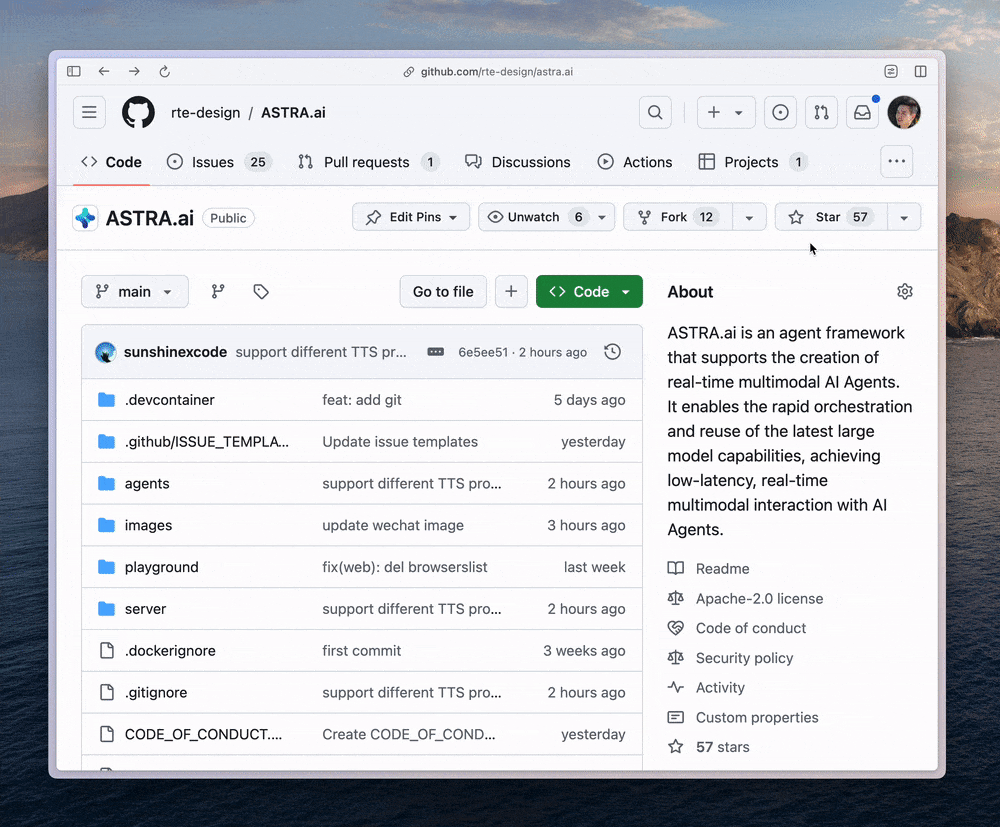

# 🌟 Welcome to TEN

Welcome to TEN! TEN stands for Transformative Extensions Network, [ **an open-source framework** ](https://github.com/TEN-framework/ten_framework) for quickly creating multimodal AI agents. It features the all-in-one TEN Manager, written in Rust, supports multimodal protocols, includes the TEN Runtime, offers the Graph Designer, and has an Extension Store to share in community.

Here, you’ll get an overview of all the incredible features TEN offers to help you build engaging and interactive experiences.

Before we get started, please click the [**star button on our GitHub repo**](https://github.com/TEN-framework/ten_framework) to stay updated with TEN.

TEN’s capabilities are immense, and we’ve harnessed its power to create a real-time multimodal agent that we actively maintain and support. You can explore this agent in our dedicated repository of [ **Astra Agent** ](https://github.com/ten-framework/astra.ai) We’d love to have your support, don’t forget to give it a star as well!

<figure><figcaption>
Star us to stay updated with Astra Agent
</figcaption></figure>
