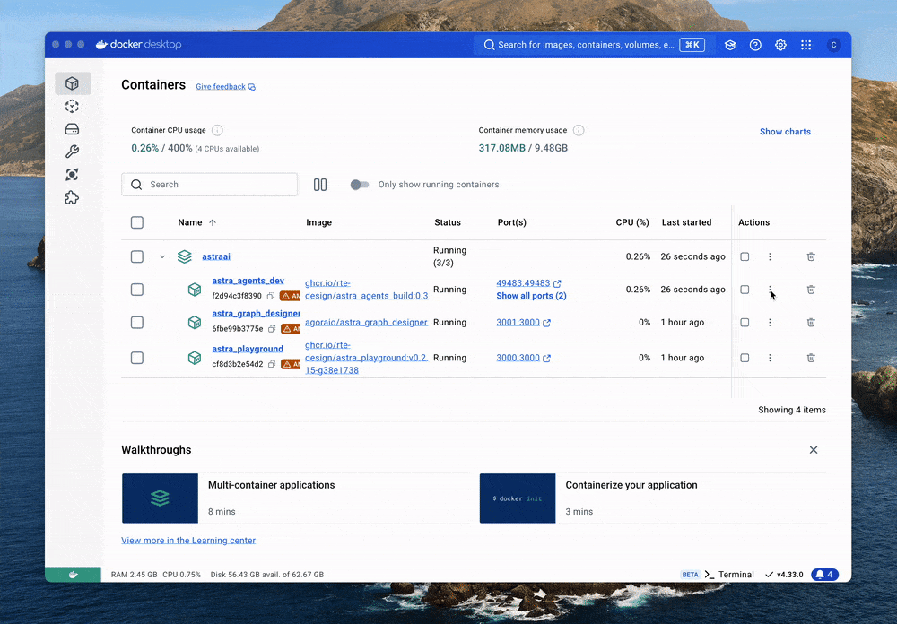

---
layout:
  title:
    visible: true
  description:
    visible: false
  tableOfContents:
    visible: true
  outline:
    visible: true
  pagination:
    visible: true
---

# Create a hello world extension

In this chapter, we are going to create a `Hello World` extension step by step, available in Python, Go, and C++. Feel free to choose whichever language you prefer. So buckle up.

## Prerequisites

Before diving into this chapter, you’ll need to be familiar with the [basics covered earlier](quickstart.md). Specifically, ensure you understand how to use `docker compose up` and are aware of the services running in the background.

## 1. Compose up the servers

First things first, let’s start by composing the servers. Run the following command:


If the caption says `Terminal`, it means you are running the command locally. If the caption says `Bash`, it means you are running the command in the Docker container.




```bash
docker compose up
```



Once the command is entered, you should see output similar to this:

<pre class="language-bash" data-title=">_ Terminal"><code class="lang-bash">....
Attaching to ten_agent_dev, ten_agent_playground
ten_agent_dev         | cd agents && tman designer
ten_agent_dev         | :-)  Starting server at http://0.0.0.0:49483
ten_agent_playground  |   ▲ Next.js 14.2.4
ten_agent_playground  |   - Local:        http://localhost:3000
ten_agent_playground  |   - Network:      http://0.0.0.0:3000
ten_agent_playground  |
ten_agent_playground  |  ✓ Starting...
ten_agent_playground  |  ✓ Ready in 429ms
...
</code></pre>

Now, we’ve got the following services running:

• `ten_agent_dev` at `http://0.0.0.0:49483` (dev server)

• `ten_agent_playground` at `http://localhost:3000` (TEN Agent playground)

## 2. Enter the docker container

To work within the isolated environment, run the following command:



```bash
docker exec -it ten_agent_dev bash
```



## 3. Create the hello world extension

By running the following commands, an extension called `hello_world` will be created in Python, Go, or C++.



<pre class="language-bash" data-title=">_ Bash" data-overflow="wrap"><code class="lang-bash">
cd /app/agents/ten_packages/extension
<strong>tman create extension hello_world --template=default_async_extension_python --template-data class_name_prefix=HelloWorld
</strong>
</code></pre>



<pre class="language-bash" data-title=">_ Bash" data-overflow="wrap"><code class="lang-bash">
cd /app/agents/ten_packages/extension
<strong>tman create extension hello_world --template=default_extension_go --template-data class_name_prefix=HelloWorld
</strong>
</code></pre>



<pre class="language-bash" data-title=">_ Bash" data-overflow="wrap"><code class="lang-bash">
cd /app/agents/ten_packages/extension
<strong>tman create extension hello_world --template=default_extension_cpp --template-data class_name_prefix=HelloWorld
</strong>
</code></pre>



After running the command, the log will display something like this:

<pre class="language-bash" data-title=">_ Bash"><code class="lang-bash">
Package 'extension:hello_world' created successfully in '/app' in 3 seconds.
</code></pre>

## 4. Adding API to the extension

Navigate into the `hello_world` directory and open manifest.json. Add the API objects with `data_in` and `cmd_out`:

<pre class="language-json" data-title="./hello_world/manifest.json"><code class="lang-json">{
  "type": "extension",
  "name": "hello_world",
  "version": "0.3.1",
  "dependencies": [
    {
      "type": "system",
      "name": "ten_runtime_python",
      "version": "0.3.1"
    }
  ],
  "package": {
    "include": [
      "manifest.json",
      "property.json",
      "BUILD.gn",
      "**.tent",
      "**.py",
      "README.md",
      "tests/**"
    ]
  },
  "api": {
<strong>    "data_in": [
</strong><strong>      {
</strong><strong>        "name": "text_data",
</strong><strong>        "property": {
</strong><strong>          "text": {
</strong><strong>            "type": "string"
</strong><strong>          },
</strong><strong>          "is_final": {
</strong><strong>            "type": "bool"
</strong><strong>          }
</strong><strong>        }
</strong><strong>      }
</strong><strong>    ],
</strong><strong>    "cmd_out": [
</strong><strong>      {
</strong><strong>        "name": "flush"
</strong><strong>      }
</strong><strong>    ]
</strong>  }
}
</code></pre>

## 5. Build the extension

Let's use `cd /app` command to go back to the root of the project, and run `make build` to build the extension.



```bash
cd /app

task use
```



## 6. Restart the server

You don’t need to restart the server when you first build the agent. However, after making minor updates, if refreshing the page doesn’t apply the changes, you’ll need to restart the server in Docker to ensure the updates take effect.

<figure><figcaption><p>Restart the server for ten_agent_dev</p></figcaption></figure>

## 7. Verify the extension

Congratulations! You’ve successfully created your first `hello_world` extension.
