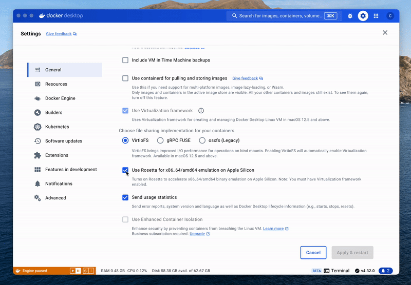

---
layout:
  title:
    visible: true
  description:
    visible: false
  tableOfContents:
    visible: true
  outline:
    visible: true
  pagination:
    visible: true
---

# Quickstart

In this chapter, we’ll build the TEN Agent together. For additional help, check out the YouTube video tutorial at the end.

## Prerequisites




* Agora App ID and App Certificate([read here on how](https://docs.agora.io/en/video-calling/get-started/manage-agora-account?platform=web))
* Azure [speech-to-text](https://azure.microsoft.com/en-us/products/ai-services/speech-to-text) and [text-to-speech](https://azure.microsoft.com/en-us/products/ai-services/text-to-speech) API keys
* [OpenAI](https://openai.com/index/openai-api/) API key




* [Docker](https://www.docker.com/) / [Docker Compose](https://docs.docker.com/compose/)
* [Node.js(LTS) v18](https://nodejs.org/en)



:tada: CPU >= 2 Core

:smile: RAM >= 4 GB



**Docker setting on Apple Silicon**


You will need to uncheck "Use Rosetta for x86\_64/amd64 emulation on Apple Silicon" option for Docker if you are on Apple Silicon, otherwise the server is not going to work.


<figure><figcaption><p>Make sure the box is unchecked</p></figcaption></figure>

## Next step

**1. Prepare config files**

In the root of the project, use `cd` command to create \`.env\` file from example . It will be used to store information for \`docker compose\` later.



```sh
cp ./.env.example ./.env
```



**2. Setup API keys & Environment variables in .env file**

Open the `.env` file and fill in the keys and regions. This is also where you can choose to use any different extensions:



```bash
# Agora App ID and App Certificate
AGORA_APP_ID=
# Certificate is only required when enabled within Agora.io account
AGORA_APP_CERTIFICATE=

# Azure STT key and region
AZURE_STT_KEY=
AZURE_STT_REGION=

# Azure TTS key and region
AZURE_TTS_KEY=
AZURE_TTS_REGION=

# OpenAI API key
OPENAI_API_KEY=
```



**3. Start agent builder toolkit containers**

In the same directory, run the `docker` command to compose containers:



```bash
docker compose up
```



**4. Build TEN Agent**&#x20;

Open up a separate terminal window, build the agent and start the server:



```bash
docker exec -it ten_agent_server bash
make build
```



**5. Start the server**

Now the server is running at port: 8080.



```bash
make run-server
```



## **Finish and verify your agent**

You can open [localhost:3001](https://localhost:3001/) in browser to use your graph designer. Simultaneously, open another tab at [localhost:3000](https://localhost:3000/) to see the customized voice agent up and running.

Now you have the power of the Graph Designer at your fingertips to perform the magic of agent customization yourself. 🎉

**Graph designer**

TEN Graph Designer (beta), a tool that requires zero coding knowledge and makes the experience of creating agentic applications smoother.

<figure><figcaption><p>Graph Designer</p></figcaption></figure>

## Video tutorials

English:
<https://www.youtube.com/watch?t=1s&v=_AZ3RedzvRg>

中文:
<https://www.youtube.com/watch?v=MbqF4c2Myrw>
