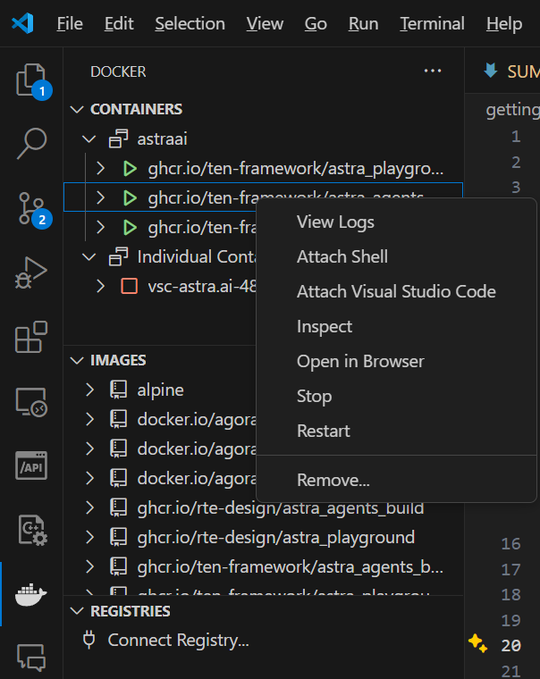

# Setting Up VSCode for Development Inside Container

When developing with TEN, it's generally recommended to perform compilation and development within a container. However, if you're using VSCode outside the container, you may encounter issues where symbols cannot be resolved. This is because some environment dependencies are installed within the container, and VSCode can't recognize the container's environment, leading to unresolved header files.

To solve this, you can mount VSCode within the container so that it recognizes the container’s environment and resolves the header files accordingly. This guide will walk you through using VSCode's Dev Containers and Docker extensions to achieve this.

## Step 1: Install the Docker Extension

First, install the [Docker extension](https://marketplace.visualstudio.com/items?itemName=ms-azuretools.vscode-docker) in VSCode. This extension allows you to manage Docker containers directly within VSCode.

## Step 2: Install the Dev Containers Extension

Next, install the [Dev Containers extension](https://marketplace.visualstudio.com/items?itemName=ms-vscode-remote.remote-containers). This extension enables VSCode to connect to Docker containers for development.

## Step 3: Start the Development Environment Using Docker Compose

This step is similar to the process outlined in the [Quick Start](./quickstart.md) guide. However, instead of running:


```shell
docker compose up
```


Using the `docker compose up -d` command, start the container in detached mode:


```shell
docker compose up -d
```


After executing this command, the container should start. Open VSCode, switch to the Docker extension, and you should see the running container.



## Step 4: Connect to the Container

In the Docker extension within VSCode, find the `astra_agents_dev` container in the list and click `Attach Visual Studio Code` to connect to the container. VSCode will then open a new window that is connected to the container, where you can proceed with development.


In the Dev Container environment connected to the container, your local extensions and settings will not be applied, as this environment is within the container. Therefore, you will need to install extensions and configure settings inside the container. To install extensions within the container, open the newly launched VSCode window, click on `Extensions` in the left sidebar, search for the required extension, and follow the prompts to install it inside the container.


