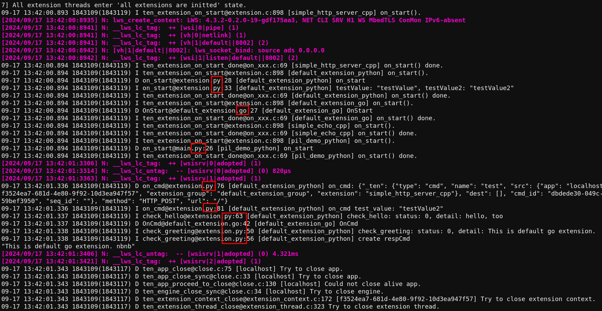

# Log

The TEN framework allows extensions developed in different languages to run within the same process. This creates a need to view logs from all these extensions in a unified log with a consistent format and information, making debugging easier.

To address this, the `ten_env` provides a logging API. Within each callback of an extension, an instance of `ten_env` can be accessed. Using this instance, you can call the logging API to output logs from extensions developed in various languages to a unified log output.

This logging API primarily has two parameters: one for the log level and another for the message itself. For ease of use, there are some convenient variations of the log API that require only a message parameter.

The overall effect is shown in the image below:

<figure><figcaption>
Unified log output for multi-language extensions
</figcaption></figure>
