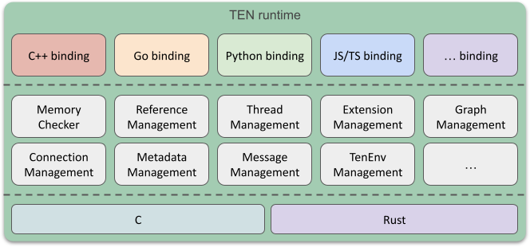
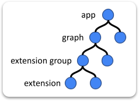
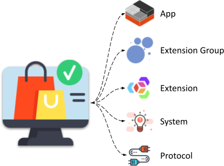

# TEN Framework Concepts Overview

<figure><figcaption>
TEN Framework
</figcaption></figure>

## TEN Runtime

The TEN runtime is an execution environment designed for running applications within the TEN framework. It provides a flexible architecture that supports extensions developed in multiple programming languages and handles various types of data streams. By managing the lifecycle of extensions, data flows, and threads, the TEN runtime offers developers a powerful tool for building a wide range of applications and services.

## App

An App in the TEN framework can operate as a standalone process or as a thread within an existing process. This flexibility allows for versatile deployment options depending on the needs of the application.

## Extension Group

An Extension Group is a mechanism that designates a specific thread for execution. All extensions within a given group are executed on the same thread, ensuring consistent and synchronized processing.

## Extension

An extension is the fundamental building block of the TEN framework. Developers can create extensions in various programming languages and combine them to build different applications and scenarios. The framework's design supports cross-language collaboration, enabling extensions written in different languages to work together seamlessly within the same application or service.

For example, a developer might use C++ to create an extension for real-time communication (RTC) due to its performance benefits in handling audio and video data, while developing an AI extension in Python to take advantage of its robust libraries for data analysis and machine learning. These extensions can then be integrated into a single application, leveraging the strengths of each language.

## Graph

A Graph in the TEN framework describes the data flow between extensions. It orchestrates how data moves from one extension to another, defining the participants and the flow of data between them. For example, you can route the output of a Speech-to-Text (STT) extension to a Large Language Model (LLM) extension for further processing.

The TEN framework supports four main types of data flows between extensions:

- Command
- Data
- Video Frame
- Audio Frame

By defining these data flows within a graph, developers can create inter-extension communication and unidirectional data streams, particularly useful for handling audio and video data.

## Relationship Among App, Group, and Extension

- **App**:

  An app can execute multiple graphs, which can be either statically predefined or dynamically assembled.

- **Graph**:

  A graph is formed by multiple extensions working together to create a meaningful scenario. Each graph instance operates as a session within the app.

- **Extension Group**:

  The concept of an extension group is analogous to a thread. Extensions written in the same language and within the same extension group run on the same thread during runtime. Developers do not need to manage threads directly; they simply "declare" the group to which each extension belongs.

- **Extension**:

  Each extension within the framework is assigned a unique ID, structured as: `app-uri/graph-name/group-name/extension-name`

<figure><figcaption>
Hierarchical Relationship of Concepts
</figcaption></figure>

## TEN Cloud Store

<figure><figcaption>
TEN Cloud Store
</figcaption></figure>

The TEN Cloud Store functions similarly to Google Play Store or Apple’s App Store, providing a marketplace for extensions. Developers can share their extensions or download those created by others. These extensions can be integrated into TEN apps, facilitating development and expanding functionality.

## TEN Manager

The TEN Manager is a tool that simplifies the management of extensions. It handles tasks such as uploading, sharing, and installing extensions, automatically managing dependencies between them and their environment. This makes the installation and publication of extensions convenient and efficient, streamlining the development process within the TEN framework.
