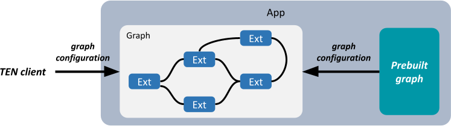

# Graph

In the TEN framework, there are two types of graphs:

1. Flexible
2. Predefined

|  | Flexible | Predefined |
|----|----|----|
| Time to start the graph | When the TEN app receives the `start_graph` command. | When the TEN app starts, or when the TEN app receives the `start_graph` command. |
| Graph content | Specified in the `start_graph` command. | Specified in the TEN app's properties. |
| Graph ID | A random UUID. |A random UUID|

<figure><figcaption><p>Two Types of Graph</p></figcaption></figure>

For predefined graphs, there is an `auto_start` attribute that determines whether the predefined graph will start automatically when the TEN app starts.

There is also another `singleton` attribute used to indicate whether the predefined graph can only generate *one* corresponding engine instance within the TEN app.

## Graph ID and Graph Name

For each graph instance generated from a graph definition, that is, an engine instance, within the TEN app, there is a unique UUID4 string representing each graph instance. This UUID4 string is called the **graph ID** of that graph.

For each predefined graph, a meaningful or easy-to-remember name can be assigned, known as the **graph name** of the predefined graph. When specifying a particular predefined graph, the graph name can be used to represent it. If a predefined graph has the singleton attribute, it means that the graph instance generated from this predefined graph can only exist once within the TEN app. Therefore, the TEN runtime will use the graph name to uniquely identify the single graph instance generated from the singleton predefined graph.

## Flexible Graph

When the TEN app receives the `start_graph` command and creates this type of graph, it will assign a random UUID value as the ID of the newly started graph. If other clients obtain this graph's ID, they can also connect to this graph.

Example of a flexible graph ID:

`123e4567-e89b-12d3-a456-426614174000`

## Predefined Graph

Predefined graphs are very similar to flexible graphs. The content of a flexible graph is included in the `start_graph` command, while the content of a predefined graph is defined by the TEN app. Clients only need to specify the name of the predefined graph they want to start in the `start_graph` command.

The main purpose of predefined graphs is for ease of use and information protection. Predefined graphs allow the client to avoid knowing the detailed content of the graph, which might be due to usability considerations or to prevent the client from accessing certain information that the graph contains.

Example of a predefined graph name:

`http-server`

When a TEN app starts, predefined graphs that are set to auto-start will also be initiated.

## Graph Definition

The definition of a graph, whether flexible or predefined, is the same. The following is the definition of a graph:

```json
{
  "nodes": [
    // Definition of nodes
  ],
  "connections": [
    // Definition of connections
  ]
}
```

Key points:

1. If there is only one app, the app field can be omitted. Otherwise, it must be specified. If there is only one app and the app field is not specified, the TEN runtime will default to using `localhost` as the app field.

2. The nodes field specifies the nodes within the graph, such as extensions, extension groups, etc.

3. For each node within the graph, it can only appear once in the nodes field. If it appears multiple times, the TEN framework will throw an error, either during graph validation by the TEN manager or during graph validation by the TEN runtime.

4. The way to specify an extension group within the nodes field is as follows.

   The property field is optional.

   ```json
   {
     "type": "extension_group",
     "name": "default_extension_group",
     "addon": "default_extension_group",
     "app": "msgpack://127.0.0.1:8001/",
     "property": {
       "root_key": "player",
       "extra_keys": [
         "playerName"
       ]
     }
   }
   ```

5. The way to specify an extension within the nodes field is as follows.

   The property field is optional. The addon field is also optional.

   - If the addon field is present, it indicates that the extension is an instance generated by that addon.
   - If the addon field is not present, it indicates that the extension is not generated by an addon but is created by the corresponding extension group. In such cases, it generally does not need to be explicitly defined in the nodes field, but if you want to specify its property field, it must be explicitly defined in the nodes field.

   ```json
   {
     "type": "extension",
     "name": "simple_http_server_cpp",
     "addon": "simple_http_server_cpp",
     "extension_group": "default_extension_group",
     "app": "msgpack://127.0.0.1:8001/",
     "property": {
       "root_key": "player",
       "extra_keys": [
         "playerName"
       ]
     }
   }
   ```

6. The connections field specifies the connections between nodes within the graph.

   In each connection, the values for extension and extension group are strings representing the names of the corresponding nodes.

A complete example is as follows:

```json
{
  "nodes": [
    {
      "type": "extension_group",
      "name": "default_extension_group",
      "addon": "default_extension_group",
      "app": "msgpack://127.0.0.1:8001/"
    },
    {
      "type": "extension",
      "name": "simple_http_server_cpp",
      "addon": "simple_http_server_cpp",
      "extension_group": "default_extension_group",
      "property": {
        "root_key": "player",
        "extra_keys": [
          "playerName"
        ]
      }
    }
  ],
  "connections": [
    {
      "app": "msgpack://127.0.0.1:8001/",
      "extension": "simple_http_server_cpp",
      "cmd": [
        {
          "name": "start",
          "dest": [
            {
              "app": "msgpack://127.0.0.1:8001/",
              "extension": "gateway"
            }
          ]
        },
        {
          "name": "stop",
          "dest": [
            {
              "app": "msgpack://127.0.0.1:8001/",
              "extension": "gateway"
            }
          ]
        }
      ]
    },
    {
      "app": "msgpack://127.0.0.1:8001/",
      "extension": "gateway",
      "cmd": [
        {
          "name": "push_status_online",
          "dest": [
            {
              "app": "msgpack://127.0.0.1:8001/",
              "extension": "uap"
            }
          ]
        }
      ]
    }
  ]
}
```

## Definition of Predefined Graph

Essentially, you place the complete graph definition above under the `predefined_graphs` field in the app's properties. The `predefined_graphs` field will also have its attributes, such as name, auto_start, etc.

```json
"predefined_graphs": [
  {
    "name": "default",
    "auto_start": true,
    "singleton": true,
    // Place the complete graph definition here.
  }
]
```

So it looks like this:

```json
"predefined_graphs": [
  {
    "name": "default",
    "auto_start": true,
    "singleton": true,
    "nodes": [
      {
        "type": "extension_group",
        "name": "default_extension_group",
        "addon": "default_extension_group",
        "app": "msgpack://127.0.0.1:8001/"
      },
      {
        "type": "extension",
        "name": "simple_http_server_cpp",
        "addon": "simple_http_server_cpp",
        "extension_group": "default_extension_group",
        "property": {
          "root_key": "player",
          "extra_keys": [
            "playerName"
          ]
        }
      }
    ],
    "connections": [
      {
        "app": "msgpack://127.0.0.1:8001/",
        "extension": "simple_http_server_cpp",
        "cmd": [
          {
            "name": "start",
            "dest": [
              {
                "app": "msgpack://127.0.0.1:8001/",
                "extension": "gateway"
              }
            ]
          },
          {
            "name": "stop",
            "dest": [
              {
                "app": "msgpack://127.0.0.1:8001/",
                "extension": "gateway"
              }
            ]
          }
        ]
      },
      {
        "app": "msgpack://127.0.0.1:8001/",
        "extension": "gateway",
        "cmd": [
          {
            "name": "push_status_online",
            "dest": [
              {
                "app": "msgpack://127.0.0.1:8001/",
                "extension": "uap"
              }
            ]
          }
        ]
      }
    ]
  }
]
```

## Definition of the `start_graph` Command

Essentially, you place the complete graph definition above under the `ten` field in the `start_graph` command. The `start_graph` command will also have its attributes, such as type, seq_id, etc.

```json
{
  "_ten": {
    "type": "start_graph",
    "seq_id": "55"
    // Place the complete graph definition here.
  }
}
```

The following is a complete definition of the `start_graph` command:

```json
{
  "_ten": {
    "type": "start_graph",
    "seq_id": "55",
    "nodes": [
      {
        "type": "extension_group",
        "name": "default_extension_group",
        "addon": "default_extension_group",
        "app": "msgpack://127.0.0.1:8001/"
      },
      {
        "type": "extension",
        "name": "simple_http_server_cpp",
        "addon": "simple_http_server_cpp",
        "extension_group": "default_extension_group",
        "property": {
          "root_key": "player",
          "extra_keys": [
            "playerName"
          ]
        }
      }
    ],
    "connections": [
      {
        "app": "msgpack://127.0.0.1:8001/",
        "extension": "simple_http_server_cpp",
        "cmd": [
          {
            "name": "start",
            "dest": [
              {
                "app": "msgpack://127.0.0.1:8001/",
                "extension": "gateway"
              }
            ]
          },
          {
            "name": "stop",
            "dest": [
              {
                "app": "msgpack://127.0.0.1:8001/",
                "extension": "gateway"
              }
            ]
          }
        ]
      },
      {
        "extension": "gateway",
        "cmd": [
          {
            "name": "push_status_online",
            "dest": [
              {
                "extension": "uap"
              }
            ]
          }
        ]
      }
    ]
  }
}
```

## Specification for Graph Definition

- **Requirement for `nodes` Field**:
  The `nodes` array is mandatory in a graph definition. Conversely, the `connections` array is optional but encouraged for defining inter-node communication.

- **Validation of Node `app` Field**:
  The `app` field must never be set to `localhost` under any circumstances. In a single-app graph, the `app` URI should not be specified. In a multi-app graph, the value of the `app` field must match the `_ten::uri` value defined in each app's `property.json`.

- **Node Uniqueness and Identification**:
  Each node in the `nodes` array represents a specific extension instance within a group of an app, created by a specified addon. Therefore, each extension instance should be uniquely represented by a single node. A node must be uniquely identified by the combination of `app`, `extension_group`, and `name`. Multiple entries for the same extension instance are not allowed. The following example is invalid because it defines multiple nodes for the same extension instance:

  ```json
  {
    "nodes": [
      {
        "type": "extension",
        "name": "some_ext",
        "addon": "addon_1",
        "extension_group": "test"
      },
      {
        "type": "extension",
        "name": "some_ext",
        "addon": "addon_2",
        "extension_group": "test"
      }
    ]
  }
  ```

- **Consistency of Extension Instance Definition in Connections**:
  All extension instances referenced in the `connections` field, whether as a source or destination, must be explicitly defined in the `nodes` field. Any instance not defined in the `nodes` array will cause validation errors.

  For example, the following is invalid because the extension instance `ext_2` is used in the `connections` field but is not defined in the `nodes` field:

  ```json
  {
    "nodes": [
      {
        "type": "extension",
        "name": "ext_1",
        "addon": "addon_1",
        "extension_group": "some_group"
      }
    ],
    "connections": [
      {
        "extension": "ext_1",
        "cmd": [
          {
            "name": "hello",
            "dest": [
              {
                "extension": "ext_2"
              }
            ]
          }
        ]
      }
    ]
  }
  ```

- **Consolidation of Connection Definitions**:
  Within the `connections` array, all messages related to the same source extension instance must be grouped within a single section. Splitting the information across multiple sections for the same source extension instance leads to inconsistencies and errors.

  For example, the following is incorrect because the messages from `ext_1` are divided into separate sections:

  ```json
  {
    "connections": [
      {
        "extension": "ext_1",
        "cmd": [
          {
            "name": "hello",
            "dest": [
              {
                "extension": "ext_2"
              }
            ]
          }
        ]
      },
      {
        "extension": "ext_1",
        "data": [
          {
            "name": "hello",
            "dest": [
              {
                "extension": "ext_2"
              }
            ]
          }
        ]
      }
    ]
  }
  ```

  The correct approach is to consolidate all messages for the same source extension instance into one section:

  ```json
  {
    "connections": [
      {
        "extension": "ext_1",
        "cmd": [
          {
            "name": "hello",
            "dest": [
              {
                "extension": "ext_2"
              }
            ]
          }
        ],
        "data": [
          {
            "name": "hello",
            "dest": [
              {
                "extension": "ext_2"
              }
            ]
          }
        ]
      }
    ]
  }
  ```

- **Consolidation of Destinations for Unique Messages**:
  For each message within a specific type (e.g., `cmd` or `data`), the destination extension instances must be grouped under a single entry for that message. Repeating the same message name with separate destinations leads to inconsistency and validation errors.

  For example, the following is incorrect due to separate entries for the message named `hello`:

  ```json
  {
    "connections": [
      {
        "extension": "ext_1",
        "cmd": [
          {
            "name": "hello",
            "dest": [
              {
                "extension": "ext_2"
              }
            ]
          },
          {
            "name": "hello",
            "dest": [
              {
                "extension": "ext_3"
              }
            ]
          }
        ]
      }
    ]
  }
  ```

  The correct approach is to consolidate all destinations for the same message under a single entry:

  ```json
  {
    "connections": [
      {
        "extension": "ext_1",
        "cmd": [
          {
            "name": "hello",
            "dest": [
              {
                "extension": "ext_2"
              },
              {
                "extension": "ext_3"
              }
            ]
          }
        ]
      }
    ]
  }
  ```

  However, messages with the same name can exist across different types, such as `cmd` and `data`, without causing conflicts.

For further examples, refer to the `check graph` command documentation within the TEN framework's `tman`.
