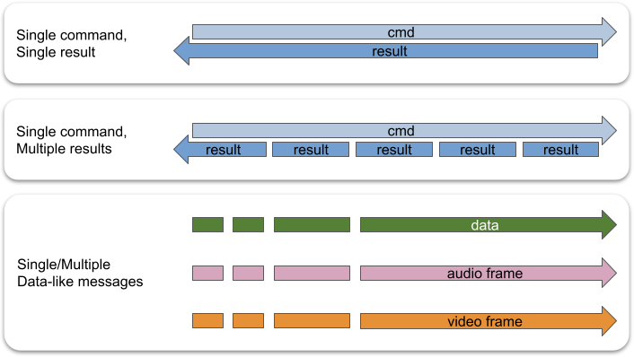
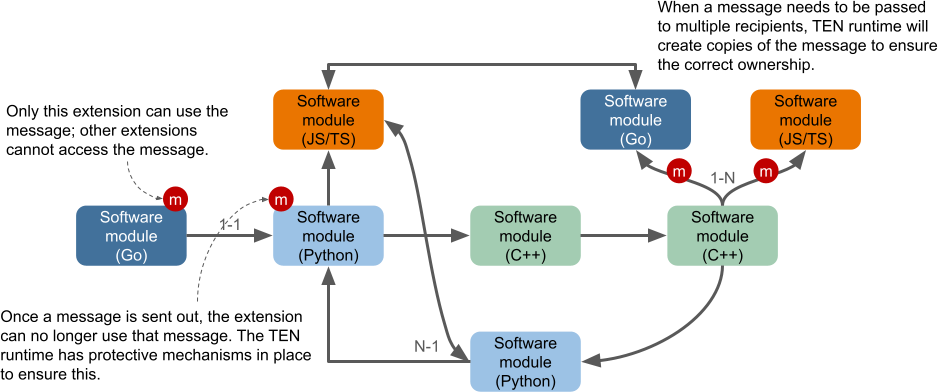

# Message System

## Message Types

In the TEN framework, messages are categorized into four types:

1. Command
2. Data
3. Video Frame
4. Audio Frame

The primary difference between a command and non-command message types is that commands have a result, while non-commands do not.

Corresponding to these types, extensions have four message callbacks:

1. `OnCmd`
2. `OnData`
3. `OnVideoFrame`
4. `OnAudioFrame`

Here is a classification diagram of TEN framework messages:

```text
┌── has result
│   └── Command
│       ├── TEN framework built-in command
│       │    => message name starts with `ten:`
│       └── Non-TEN framework built-in command
│            => message name does not start with `ten:`
└── no result
    ├── Data
    │   ├── TEN framework built-in data
    │   │    => message name starts with `ten:`
    │   └── Non-TEN framework built-in data
    │        => message name does not start with `ten:`
    ├── Video Frame
    │   ├── TEN framework built-in video frame
    │   │    => message name starts with `ten:`
    │   └── Non-TEN framework built-in video frame
    │        => message name does not start with `ten:`
    └── Audio Frame
        ├── TEN framework built-in audio frame
        │    => message name starts with `ten:`
        └── Non-TEN framework built-in audio frame
             => message name does not start with `ten:`
```

## Message Name

A message name in the TEN framework is used to differentiate messages of the same type but with different purposes. Extensions use different message names to determine the actions they need to take.

Naming rules for message names are as follows:

1. The first character must be a letter (`a-z`, `A-Z`) or an underscore (`_`).
2. Subsequent characters can be letters (`a-z`, `A-Z`), digits (`0-9`), or underscores (`_`).

## Message Flow

<figure><figcaption><p>Message Flow</p></figcaption></figure>

The TEN framework supports three message flow patterns:

1. **One message, one result.**

   Suitable when an action produces a single result.

2. **One message, multiple results.**

   Suitable when an action produces multiple results.

3. **Multiple messages.**

   Suitable for actions that do not require results.

## Extension Message Interface

The `api` field in an extension's manifest presents the extension's external message interface. The `api` field in the manifest can contain the following types of API information:

- `cmd_in`
- `cmd_out`
- `data_in`
- `data_out`
- `audio_frame_in`
- `audio_frame_out`
- `video_frame_in`
- `video_frame_out`

An example of these API definitions is as follows:

```json
{
  "api": {
    "cmd_in": [
      {
        "name": "cmd_foo",
        "property": {
          "foo": {
            "type": "int8"
          },
          "bar": {
            "type": "string"
          }
        },
        "result": {
          "property": {
            "aaa": {
              "type": "int8"
            },
            "bbb": {
              "type": "string"
            }
          }
        }
      }
    ],
    "cmd_out": [],
    "data_in": [
      {
        "name": "data_foo",
        "property": {
          "foo": {
            "type": "int8"
          },
          "bar": {
            "type": "string"
          }
        }
      }
    ],
    "data_out": [],
    "video_frame_in": [],
    "video_frame_out": [],
    "audio_frame_in": [],
    "audio_frame_out": []
  }
}
```

The message pairing mechanism between different extensions in the TEN framework is similar to function calls in traditional programming languages. Here's a simple analogy:

1. The message name is akin to a function name, and the pairing mechanism between extensions' messages is like the function call mechanism.
2. Message properties are similar to function parameters.
3. When the TEN framework determines that an output message `foo` from extension A pairs with an input message `foo` from extension B, it's analogous to a function pointer in extension A pointing to the function `foo` in extension B.
4. The pairing is based solely on the message name, not the message properties. This means the TEN framework does not support a mechanism analogous to function overloading.

Therefore, the message name is crucial for the input/output messages of each extension, serving as the control plane interface for that extension.

Although the TEN framework provides a language-agnostic calling mechanism at the single-message level, it also allows static and dynamic checks on the calling relationships between extensions through the TEN schema. This helps detect potential issues, such as differing interpretations of a property type between a source and a destination extension. Users can define their message names and determine the calling relationships between extensions through graphs. The TEN framework also offers static check tools to ensure these relationships do not cause any problems.

## Message Ownership Concept in the TEN Framework

In the TEN framework, once a message is successfully sent, the extension that sent the message can no longer use it. This concept is crucial for maintaining message safety and thread safety within the framework.

<figure><figcaption><p>Message Processing Follows the Concept of Ownership</p></figcaption></figure>

There are two directions in which messages can be sent: **send** and **return**. Only command messages have a return direction; data, audio_frame, and video_frame messages do not. After a message is sent, it may go through various processing steps, and allowing an extension to continue using the message could lead to thread safety issues. For instance, another extension handling the message might be running in a different thread. Even if the initial extension continues to use the message without any visible issues, this behavior is undefined and should not be relied upon by developers.

The TEN runtime enforces various safeguards to ensure that an extension cannot use a message after it has been successfully sent.

### Message Ownership Transfer to the Extension

When the TEN framework delivers a message to an extension via the `OnCmd`, `OnData`, `OnVideoFrame`, or `OnAudioFrame` callbacks, the framework transfers ownership of the message to the extension. This transfer of ownership means that the TEN framework guarantees that only the receiving extension has access to the message, ensuring message safety and thread safety. The extension can freely use the message and must return ownership to the TEN framework when it no longer needs the message. After returning ownership, the extension must not interact with the message any further.

### Message Ownership Transfer to the TEN Framework

When an extension sends a message back to the TEN runtime using APIs like `SendCmd`, `ReturnResult`, `SendData`, `SendVideoFrame`, or `SendAudioFrame`, the extension transfers ownership of the message back to the TEN framework.

### Ownership of Data Related to Messages

The concept of ownership extends beyond the message itself to all resources associated with that message. Just like the message, each resource's ownership can only belong to one extension at a time, and it mirrors the message's ownership. This design ensures both message and thread safety within the TEN framework.

For example, if extension A owns a message and uses a buffer within that message, it must return ownership of both the message and the buffer to the TEN runtime when it no longer needs them.

### Copy Semantics by Default

To prevent issues such as data races caused by multiple extensions handling the same resource simultaneously, the TEN framework defaults to **copy semantics** when transmitting data across TEN runtime and extension boundaries. Copying ensures that ownership is separated, maintaining safety.

### Borrowing Semantics

The TEN framework also supports **borrowing semantics**, allowing an extension to use a resource without taking ownership. This approach enhances resource utilization while maintaining message and thread safety. Borrowing APIs must be used in conjunction with GiveBack APIs to ensure the safety and integrity of resources.

When an extension returns ownership of a message to the TEN runtime, the runtime will only accept the message if all associated resources have also been returned. For instance, if extension A borrows a data message's buffer but does not return the buffer's ownership before returning the message itself, the TEN runtime will reject the message (e.g., `SendData` will fail).

### Borrowing API

Extensions can directly access resources within a message using borrowing APIs, allowing temporary use without transferring ownership.

### GiveBack API

The GiveBack APIs are used to return the ownership of resources back to the TEN framework, ensuring that resources are safely managed and freed when no longer needed.

## Command

TEN clients and TEN extensions can send commands to other TEN extensions.

If a command is used in a situation where the result isn't needed, it's fine. TEN runtime will automatically discard any unnecessary results.

### Result

A result is the response to a command. For example, when TEN extension A sends command X to TEN extension B, after processing the command, TEN extension B will send a result back to TEN extension A. The result may include any meaningful details, allowing TEN extension A to gain more information about the execution outcome.

A typical result's JSON representation might look like this:

```json
{
  "_ten": {
    "status_code": 400
  }
}
```
