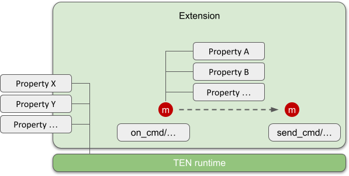

# TEN Metadata System Overview

The TEN framework utilizes a consistent metadata system across various types of packages, including:

- App
- Extension Group
- Extension
- Protocol
- System

## Types of Metadata

In the TEN metadata system, there are two primary types of metadata:

### 1. **Manifest**

- **Location**: Stored in the root directory of the associated TEN package with the file name `manifest.json`.
- **Contents**:
  - **Package Name**: The name of the TEN package.
  - **Package Version**: The version of the TEN package, following semantic versioning.
  - **TEN Schemas**: Defines schemas related to the package's properties and input/output messages.
    - **Property Schema**: These schemas are often defined in a `property.json` file in the root directory. The manifest can specify the schema for these properties.
    - **Message Schema**: Defines the schema for input/output messages handled by the package.

> ⚠️ **Note**: The TEN schema in `manifest.json` is *not* a JSON schema. Instead, it describes the metadata of TEN values, which are central to the TEN runtime, while JSON is merely a representation format.

### 2. **Property**

- **Location**: Typically stored in a `property.json` file in the root directory of the TEN package.
- **Purpose**: The `property.json` file stores initial property values, which are read-write during runtime. This means that properties can be modified while the TEN runtime is executing.

#### Example of `property.json`

```json
{
  "Darth Vader": "I am your father"
}
```

## Manifest File

The `manifest.json` file serves as the blueprint for the TEN package, defining its metadata, properties, and the input/output messages it handles.

### Example of `manifest.json`

```json
{
  "type": "app",
  "name": "default_app_cpp",
  "version": "1.0.0",
  "dependencies": [
    {
      "type": "system",
      "name": "ten_runtime",
      "version": "1.0.0"
    }
  ],
  "api": {
    "property": {
      "exampleInt8": {
        "type": "int8"
      },
      "exampleString": {
        "type": "string"
      }
    },
    "cmd_in": [
      {
        "name": "cmd_foo",
        "property": {
          "foo": {
            "type": "int8"
          },
          "bar": {
            "type": "string"
          }
        },
        "result": {
          "property": {
            "detail": {
              "type": "string"
            },
            "aaa": {
              "type": "int8"
            },
            "bbb": {
              "type": "string"
            }
          }
        }
      }
    ],
    "cmd_out": [],
    "data_in": [
      {
        "name": "data_foo",
        "property": {
          "foo": {
            "type": "int8"
          },
          "bar": {
            "type": "string"
          }
        }
      }
    ],
    "data_out": [],
    "video_frame_in": [],
    "video_frame_out": [],
    "audio_frame_in": [],
    "audio_frame_out": []
  }
}
```

### Purpose of TEN Schema in Manifest

The TEN schema in `manifest.json` provides the TEN runtime with metadata about the extension's external API, including the type information for properties and messages. This helps the runtime correctly handle the extension's properties and messages during operation.

### When TEN Schema is Used

1. **Property Validation**: When the TEN runtime gets/sets properties of a TEN package or message.
2. **Data Conversion**: When converting a JSON document to a TEN package or message property using the `from_json` API.
3. **Compatibility Check**: When the TEN manager checks if a message can be output from a source extension to a destination extension according to the TEN schema.

## Property Management

In the TEN framework, there are two types of properties:

1. **Message Properties**: These properties are associated with the messages exchanged between extensions within the framework. Message properties define the specific data or parameters that are carried within a message, such as command parameters, data payloads, or metadata related to audio/video frames.

2. **TEN Package Properties**: These properties are associated with the TEN packages themselves, such as extensions. TEN package properties define the configuration or settings specific to a package. For example, an extension might have properties that configure its behavior, such as runtime settings, initialization parameters, or other configuration data.

Both types of properties are managed within the TEN framework but serve different purposes, one focuses on the communication between components (message properties), while the other pertains to the configuration and operation of the components themselves (TEN package properties).

<figure><figcaption><p>Property system</p></figcaption></figure>

### Defining TEN Package Properties

The `property.json` file defines the properties of a TEN package. Here’s an example:

```json
{
  "prop_1_name": 0,
  "prop_2_name": "prop_2_value",
  "prop_3_name": [
    "hello",
    "prop_3_sub_value"
  ],
  "prop_4_name": {
    "prop_4_1_name": 1,
    "prop_4_2_name": "prop_4_sub_value"
  }
}
```

> ⚠️ **Note**: Each property name in the `property.json` file must be unique.

### TEN Schema for Properties

You can define a TEN schema for properties in the `manifest.json` file, enabling the TEN runtime to handle these properties more effectively. If a property does not have a corresponding TEN schema, the runtime will use the default JSON handling method (e.g., treating all JSON numbers as `float64`). If a TEN schema is provided, the runtime will use it to validate and process the property accordingly.

| Property | TEN Schema | Effect |
|----------|------------|--------|
| Yes      | Yes        | The TEN runtime validates the property value based on the TEN schema (e.g., checking the type). |
| Yes      | No         | The TEN runtime uses default handling, treating all JSON numbers as `float64`. |

### Accessing Properties from an Extension

The TEN runtime provides APIs for extensions to access various properties.

### Specifying Property Values in the `start_graph` Command

Property values related to the TEN package can be specified in the `start_graph` command. The TEN runtime processes these properties according to the TEN schema (if defined) and stores them within the corresponding TEN package instance.

#### Example of Property Specification in `start_graph` Command

```json
{
  "nodes": [{
    "type": "extension_group",
    "name": "foo_extension_group",
    "addon": "foo_extension_group_addon"
  },{
    "type": "extension",
    "name": "bar_extension",
    "extension_group": "foo_extension_group",
    "property": {
      "prop_1_name": 0,
      "prop_2_name": "prop_2_value",
      "prop_3_name": [
        "hello",
        "prop_3_sub_value"
      ],
      "prop_4_name": {
        "prop_4_1_name": 1,
        "prop_4_2_name": "prop_4_sub_value"
      }
    }
  }]
}
```
