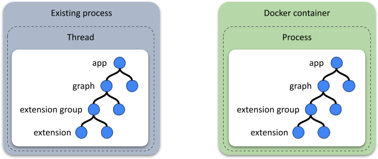
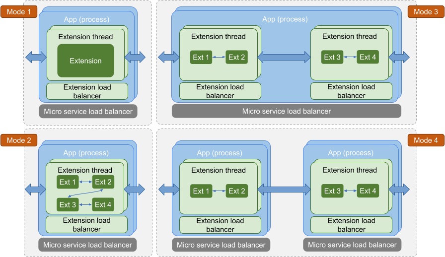
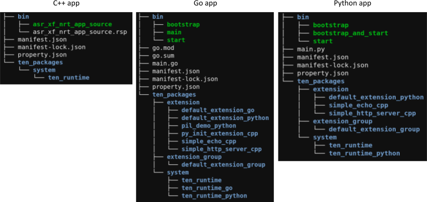

# App

App is the container in the TEN world, containing groups and extensions.
App can function as a process placed inside a Docker container (primarily used in the cloud).
App can also function as a thread embedded within an existing app (on client or server).
⇒ TEN can perform localized modifications (minor enhancements) on an existing project without requiring the entire project to be rewritten according to TEN.

<figure><figcaption>
Run TEN as a Process or a Thread
</figcaption></figure>

<figure><figcaption>
Different mode of app running
</figcaption></figure>

## TEN App Folder Structure

In the TEN framework, developers can create TEN packages using various programming languages. Regardless of the language used, the overall folder structure of a TEN app remains consistent, ensuring uniformity across different implementations.

<figure><figcaption>
TEN package folder structure
</figcaption></figure>
