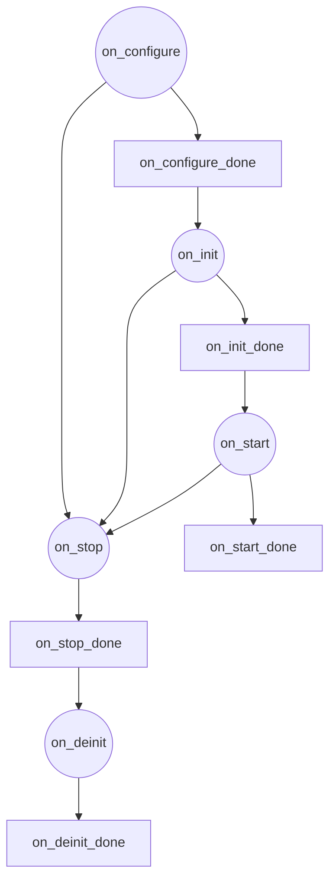
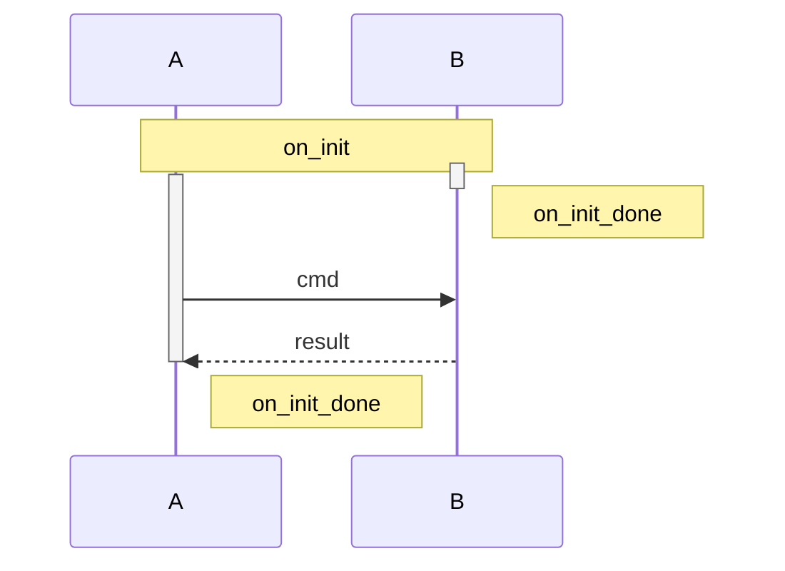
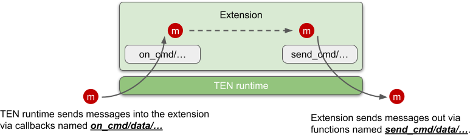

# Extension

## Life Cycle

The life cycle of an extension is divided into the following stages:

1. `on_configure`
2. `on_init`
3. `on_start`
4. `on_stop`
5. `on_deinit`

At all these stages, the extension can send messages, and if the sent message is a command type, the extension can also receive the result of the command it sent. In other words, there is no stage where the extension *cannot* send messages or receive the results of its own sent commands. So, in all these stages, the extension can send messages to other extensions, which helps implement dependencies between extensions in all stages.

Each life cycle stage corresponds to a callback function, and there is a corresponding `on_xxx_done()` function to mark the end of that life cycle stage.

| Life Cycle Callback | End of Life Cycle Function   |
|---------------------|------------------------------|
| `on_configure`      | `on_configure_done`          |
| `on_init`           | `on_init_done`               |
| `on_start`          | `on_start_done`              |
| `on_stop`           | `on_stop_done`               |
| `on_deinit`         | `on_deinit_done`             |

### Stage Transition Graph



### on_configure

Used to set the initial values of the extension's properties.

### on_init

Used to initialize the extension. Since the extension is not yet ready before `on_init_done()`, the TEN runtime will queue all messages sent to the extension until it's ready. Once ready, the queued messages are delivered to the extension. It's important to note that if the result is from a command sent by the extension itself, it is *not* subject to this restriction; the TEN runtime will directly pass the command's result back to the extension. This is because sending a command is a self-initiated action by the extension, so it must be prepared to receive and handle the result of its own commands.

### on_start

This stage marks the runtime starting to send messages into the extension. The `on_start_done` function doesn't have a special purpose, but for consistency with other life cycle stages and to reduce learning complexity, the TEN framework includes it. Typically, `on_start_done` is invoked at the end of the `on_start` callback function. The TEN runtime will start delivering messages from other extensions to this extension after receiving its `on_start_done()`.

```c++
  void on_start(ten::ten_env_t &ten_env) override {
    // Some operations.
    ten_env.on_start_done();
  }
```

### on_stop

There are many situations where the extension needs to stop, such as when the app or engine containing the extension is terminating. When the extension is about to stop, the TEN runtime uses this `on_stop` callback to notify the extension that it has entered the `on_stop` life cycle stage. The extension can then perform any necessary actions for termination.

### on_deinit

After the extension calls `on_stop_done()`, it enters the `on_deinit` stage. During this stage, because the resources within the extension may no longer be fully available, the TEN runtime will not pass any messages from other extensions to this one.

## Relationship Between Extensions at Different Life Cycle Stages

Basically, there is no inherent relationship. Each extension operates independently, switching between its own life cycle stages. Extensions are independent of one another, and any dependencies between them must be explicitly implemented by the extensions themselves. The TEN runtime does not make any assumptions or guarantees. For example, if extension A needs to wait for extension B to complete its initialization before finishing its own, extension A can send a command to extension B during its `on_init`. Once extension B completes initialization and receives the command, it can reply with a result, and when extension A receives the result, it can call `on_init_done`.



## Interface with TEN Runtime

Extensions interact with the TEN runtime primarily through three interfaces:

1. **Lifecycle Callbacks**
   - These include callbacks like `on_init`, `on_deinit`, `on_start`, and `on_stop`.

2. **Callbacks for Receiving Messages**
   - These include callbacks such as `on_cmd`, `on_data`, `on_audio_frame`, and `on_video_frame`, which handle incoming messages to the extension.

3. **Functions for Sending Messages**
   - These include functions like `send_cmd`, `send_data`, `send_audio_frame`, and `send_video_frame`, which send messages out of the extension.

## Lifecycle Callbacks

The different stages of the extension's lifecycle and their connection to message handling are as follows:

- **on_init ~ on_init_done**: Handles the extension's own initialization. During this phase, it cannot send or receive messages.

  - Once all extensions have completed `on_init_done`, they collectively transition to `on_start`.

- **on_start ~ on_start_done**: At this stage, the extension can send messages and receive responses to the messages it sends, but it cannot receive unsolicited messages. Since properties are initialized during `on_start`, you can perform actions that depend on these properties being set up. However, as this is still part of the initialization phase, the extension will not receive messages initiated by others, avoiding the need for various checks. Active message sending is allowed.

- **After on_start_done ~ on_stop_done**: During this phase, the extension can normally send and receive all types of messages and their results.

  - Once all extensions have completed `on_stop_done`, they collectively transition to `on_deinit`.

- **on_deinit ~ on_deinit_done**: Handles the extension's de-initialization. During this phase, it cannot send or receive messages.

## Implementing Extensions in Different Languages

Within the TEN framework, extensions can be implemented in various languages such as C++, Go, and Python. Developers can use the same conceptual approach to implement extensions in different languages. Learning how to develop an extension in one language makes it relatively easy to do so in other languages as well.

## Asynchronous Message Processing in Extensions

<figure><figcaption><p>Asynchronous Message Processing</p></figcaption></figure>

Extensions process messages asynchronously. When the TEN runtime delivers a message to an extension through callbacks like `on_cmd`, `on_data`, `on_audio_frame`, or `on_video_frame`, the extension is not required to process the message immediately within the callback. Instead, the extension can delegate the message to other threads, processes, or even machines for processing. This allows for full utilization of multi-core and distributed computing resources.

After processing is complete, the results can be sent back to the TEN runtime through callbacks such as `send_cmd`, `send_data`, `send_audio_frame`, or `send_video_frame`. The entire process is asynchronous, meaning the extension doesn't need to send the processed results back before the `on_cmd`, `on_data`, `on_audio_frame`, or `on_video_frame` callbacks return. The results can be transmitted only when they are actually ready, using the appropriate send functions.
