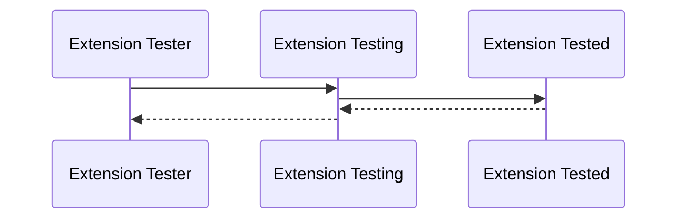

# For Users of the TEN Framework

## Standalone Testing of Extension

The TEN framework provides an independent extension testing mechanism. This mechanism allows developers to test extensions without relying on other TEN concepts, such as other TEN extensions, TEN graphs, or TEN apps. When developers need to test the behavior of an extension without running the entire TEN app, this independent extension testing mechanism is especially useful.

The standalone testing framework for TEN extensions follows two key principles:

1. Compatibility with any native testing framework of the used language.

   For example, if a TEN extension is developed using C++, the Google gtest/gmock testing framework can be used alongside the TEN extension standalone testing framework to achieve independent testing of the C++ TEN extension.

2. Users don't need to modify any code in the extension under test.

   The exact same extension code used in runtime can be fully tested using this standalone testing framework.

For users, the TEN extension standalone testing framework introduces two main concepts:

1. **extension_tester**
2. **ten_env_tester**

The role of **extension_tester** is similar to a testing driver, responsible for setting up and executing the entire testing process. **ten_env_tester**, on the other hand, behaves like a typical TEN extension's `ten_env` instance, enabling users to invoke functionalities within the standalone testing framework from the callback of `extension_tester`, such as sending messages to the extension under test and receiving messages from the extension.

## Standalone Testing Framework Internal

Internally, the TEN extension standalone testing framework implicitly starts a test app, loads the extension addon to be tested (let’s call it extension A), and initializes a graph containing both the extension A to be tested and another extension (let’s call it extension B) dedicated to testing other extensions. All input and output messages of extension A are redirected to extension B, allowing users to customize inputs and outputs during the testing process and complete the actual testing work.



## C++

Here is an example of TEN extension standalone testing using Google gtest:

```c++
class extension_tester_basic : public ten::extension_tester_t {
 public:
  void on_start(ten::ten_env_tester_t &ten_env) override {
    auto new_cmd = ten::cmd_t::create("hello_world");
    ten_env.send_cmd(std::move(new_cmd),
                     [](ten::ten_env_tester_t &ten_env,
                        std::unique_ptr<ten::cmd_result_t> result) {
                       if (result->get_status_code() == TEN_STATUS_CODE_OK) {
                         ten_env.stop_test();
                       }
                     });
  }
};

TEST(Test, Basic) {
  auto *tester = new extension_tester_basic();

  ten_string_t *path = ten_path_get_executable_path();
  ten_path_join_c_str(path, "../ten_packages/extension/default_extension_cpp/");

  tester->add_addon_base_dir(ten_string_get_raw_str(path));

  ten_string_destroy(path);

  tester->set_test_mode_single("default_extension_cpp");
  tester->run();
  delete tester;
}
```

## Golang

TODO: To be added.

## Python

```python
class ExtensionTesterBasic(ExtensionTester):
    def check_hello(self, ten_env: TenEnvTester, result: CmdResult):
        statusCode = result.get_status_code()
        print("receive hello_world, status:" + str(statusCode))

        if statusCode == StatusCode.OK:
            ten_env.stop_test()

    def on_start(self, ten_env: TenEnvTester) -> None:
        new_cmd = Cmd.create("hello_world")

        print("send hello_world")
        ten_env.send_cmd(
            new_cmd,
            lambda ten_env, result: self.check_hello(ten_env, result),
        )

        print("tester on_start_done")
        ten_env.on_start_done()


def test_basic():
    tester = ExtensionTesterBasic()
    tester.add_addon_base_dir(str(Path(__file__).resolve().parent.parent))
    tester.set_test_mode_single("default_extension_python")
    tester.run()
```
