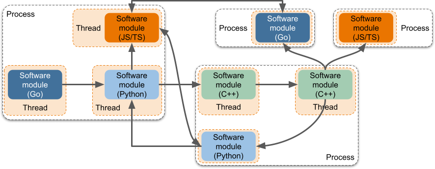
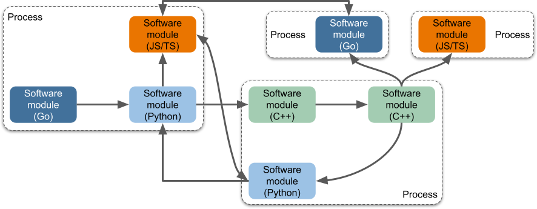

# TEN Framework Concepts Overview

## Vision

The vision of the TEN framework is to establish a modular, flexible, and scalable platform that enhances development speed, maintainability, and scalability. The framework is designed to support best engineering practices for modular development, enabling developers to create robust, efficient, and adaptable applications by leveraging comprehensive mechanisms provided by the platform.

--- 

## Key Concepts

### Modularity

1. **Defined Module Boundaries**: The framework allows for clear definition of control and data plane boundaries, which can be statically declared. This facilitates easy inspection and post-processing using offline tools.

2. **Dynamic Service Composition**: Modules within a process can be dynamically composed at runtime, without the need for static compilation, enabling flexible service configuration.

3. **Streamlined Module Integration**: In scenarios with multiple module compositions, only declarations are required, without modifying any module code or writing glue code.

4. **Decentralized Module Coupling**: The architecture allows for modules to be developed independently by different teams, with no inter-module coupling, facilitating dynamic replacement.

5. **Flexible Module Interface Communication**: Supports two types of interface communication—one requiring consistent parameters on both sides, and another allowing differences in parameters with platform-provided bridging mechanisms. This flexibility is crucial for independent module development and deployment.

### Orchestration

1. **Directed Cyclic Graph (DCG) Topologies**: Supports complex graph structures for module composition, enabling 1-to-n, n-to-1, and n-to-m interaction relationships in both control and data planes.

2. **Cross-Process and Thread Orchestration**: Allows coordination of module instances across different processes and threads to form complete service scenarios.

   <figure><figcaption>
Cross-Process and Thread Orchestration
</figcaption></figure>

3. **Dynamic Orchestration Configuration**: Orchestration can be configured dynamically at runtime or pre-configured before service execution.

### Flexible Configuration Settings

1. **Hierarchical Configuration Support**: Different module instances can have varying configuration possibilities, adaptable across different hierarchical contexts.

2. **Versatile Configuration Capabilities**: Configurations can be preset, dynamically changed during runtime, or distributed as updates.

### Diverse Releasing Capabilities

1. **Support for Binary & Source Release**: Modules can be distributed as source or binary, with both modes coexisting for the same module.

2. **Integration With Cloud Marketplace**: Modules, whether source or binary, can be published to the cloud marketplace for easy download and integration into projects.

### Multiple Instances Capability

1. **Multiple Instances of the Platform**: The platform avoids the use of global variables, supporting multiple instances within a single business process.

2. **Multiple Instances of Each Module**: Modules are developed without reliance on global variables, allowing multiple instances of the same module to run without conflict.

3. **Multiple Instances of Orchestrated Pipelines**: Supports concurrent or sequential execution of multiple orchestrated pipelines within a single process.

### Diverse Distribution Capability

1. **Dynamic Switching of Distribution Configurations**: Modules can be distributed across different processes and threads for high availability, high concurrency, and easier hot-updating.

2. **Decoupling of Distribution Configuration**: Distribution configurations are decoupled from both module code and compilation/build processes, simplifying deployment.

### Flexibility in Input/Output Support

1. **Support for Control and Data Planes**: The framework supports both command invocation and raw data transmission (audio/video/data) between modules.

2. **Support for Inter-process and Inter-thread Communication**: Modules can handle external input/output operations across processes and threads simultaneously.

3. **RPC Essence**: External input/output operations have RPC characteristics, enabling seamless module integration across different processes.

4. **Trigger Multiple Downstream Components**: A single action can trigger multiple downstream modules, with aggregated responses returned to the original module.

5. **Declarative External Input/Output**: Interfaces can be statically declared, allowing for static checks by offline tools.

6. **Simplified External Input/Output Code**: Function call interfaces, ideally auto-generated, simplify coding for module developers.

7. **Support for Non-serializable Data**: The architecture supports transmitting non-serializable data, with tools automatically recognizing and tagging such usage.

8. **Transparent Inter-process Communication**: Underlying transmission logic is abstracted away by the platform, simplifying cross-process interactions.

9. **Support for Synchronous and Asynchronous Control Plane Operations**: The control plane supports both synchronous and asynchronous interactions, allowing for bidirectional command and response flows.

10. **Support for Restricted Execution Context**: Enables synchronous interaction between modules within the same thread.

### Freedom in Developing Modules

1. **Freedom to Use Third-party Libraries**: Modules can freely utilize third-party libraries to achieve desired functionalities.

2. **Freedom to Utilize Operating System Features**: Developers can freely create and terminate native threads within modules, offering maximum development flexibility.

### Programming Language Support

1. **Support for Multiple Programming Languages**: The framework supports modules written in various languages (e.g., C/C++, Go, Java, Python), enabling diverse development environments.

   <figure><figcaption>
Programming Language Support
</figcaption></figure>

2. **Cross-language Module Integration**: Modules written in different languages can run together within the same process.

3. **Unified Interaction Across Languages**: Modules have consistent interfaces and behaviors across different languages.

4. **Unified Data Types Across Languages**: The platform provides unified data types, ensuring consistent data exchange across different programming languages.

### Rich External Interaction Capabilities

1. **UI Provider**: The architecture supports backend services providing UI components for the frontend.

2. **RESTful Interface**: Backend services can expose RESTful interfaces for client interactions.

3. **Non-intrusive Integration with Existing Services**: The framework can be integrated into existing services without requiring a complete rewrite.

4. **Single-threaded Operation**: The framework can function as a standalone process or as a thread within an existing service, avoiding conflicts with existing business logic.

### Testing Friendly

1. **Diverse Testing Mechanisms**: The framework supports various testing strategies, including unit tests, integration tests, module testing, and black-box testing.

2. **Independent Module Testing**: Modules can be tested independently, facilitating thorough and effective testing.

### Offline Processing Capability

1. **Package Manager**: The framework includes CLI and package managers for managing modules and their combinations.

2. **Orchestration Tools**: GUI tools are available for offline development and orchestration, enhancing the developer experience.

3. **Visual Debugging Tools**: The architecture supports visual debugging tools to help visualize module interactions.

### Robustness

1. **High Concurrency of Orchestrated Pipelines**: The platform supports at least 100 concurrent instances of orchestrated pipelines within a single process.

2. **High Concurrency of RESTful Interfaces**: The platform can support over 20,000 RESTful clients in a single process.

3. **High Concurrency of Non-RESTful Interfaces**: The platform can support over 1,000 non-RESTful clients in a single process.

--- 

## Application Scenarios

The TEN framework is designed to make AI feature integration and application development more efficient and flexible. Developers can create and deploy AI function extensions quickly, combining them to form customized applications or services. Typical AI scenarios include:

- **Intelligent Speech Processing**: Extensions for speech recognition (STT), speech synthesis (TTS), and sentiment analysis can be combined to create conversational systems.

- **Visual Recognition Systems**: Extensions for image recognition and video analysis can be used to build security or retail solutions with face recognition, object detection, and motion tracking.

- **Recommendation Systems and Data Analysis**: Extensions for machine learning and data processing can be combined to create personalized recommendation systems and analytical tools.

- **Interactive Education and Training Platforms**: Extensions for interactive teaching, intelligent tutoring, and assessments can be assembled into comprehensive educational technology solutions.

- **Health Monitoring and Diagnostic Systems**: Medical image analysis and AI-driven diagnostic extensions can be used to develop systems for disease monitoring and early diagnosis.

Through the TEN framework, developers can create, share, and extend AI extensions, enabling rapid development and innovation. The flexible architecture ensures scalability and maintainability, providing a solid foundation for modern AI solutions.
